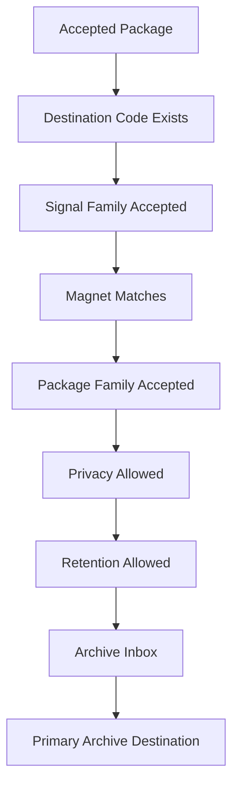
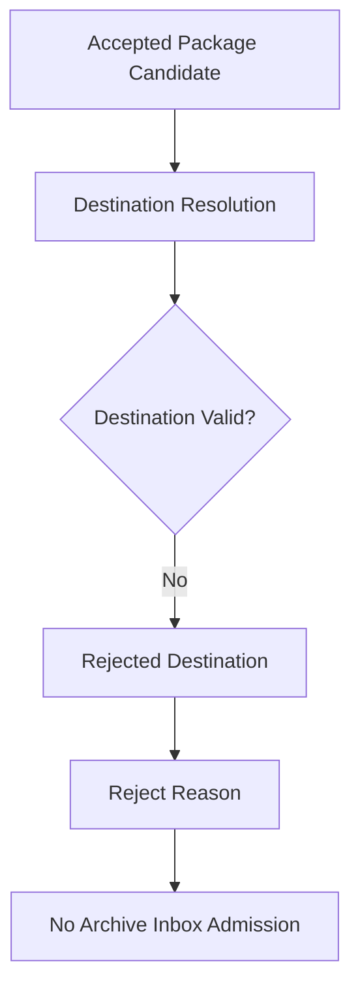
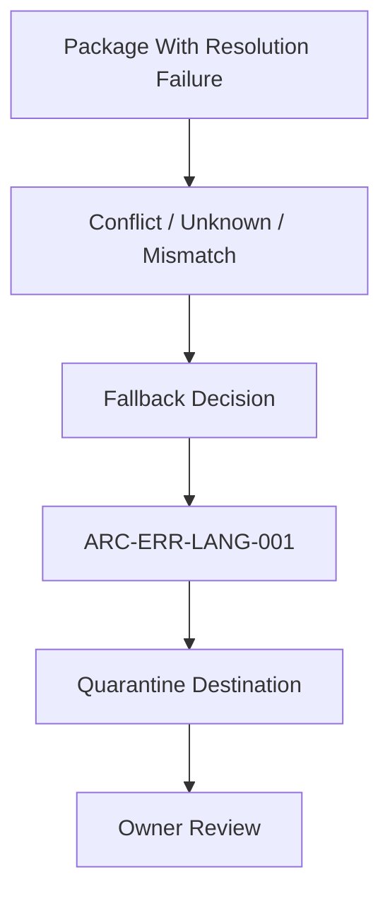
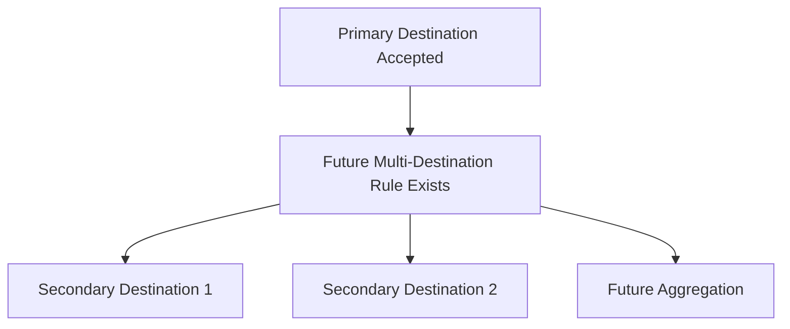

# Archive Destination Resolution Mermaid V1

Status: ACTIVE
Date: 2026-07-02

## Accepted Destination

```mermaid
flowchart TD
  A["Accepted Package"] --> B["Destination Code Exists"]
  B --> C["Signal Family Accepted"]
  C --> D["Magnet Matches"]
  D --> E["Package Family Accepted"]
  E --> F["Privacy Allowed"]
  F --> G["Retention Allowed"]
  G --> H["Archive Inbox"]
  H --> I["Primary Archive Destination"]
```

## Rejected Destination

```mermaid
flowchart TD
  A["Accepted Package Candidate"] --> B["Destination Resolution"]
  B --> C{"Destination Valid?"}
  C -- "No" --> D["Rejected Destination"]
  D --> E["Reject Reason"]
  E --> F["No Archive Inbox Admission"]
```

## Fallback Destination

```mermaid
flowchart TD
  A["Package With Resolution Failure"] --> B["Conflict / Unknown / Mismatch"]
  B --> C["Fallback Decision"]
  C --> D["ARC-ERR-LANG-001"]
  D --> E["Quarantine Destination"]
  E --> F["Owner Review"]
```

## Future Multi-Destination

```mermaid
flowchart TD
  A["Primary Destination Accepted"] --> B["Future Multi-Destination Rule Exists"]
  B --> C["Secondary Destination 1"]
  B --> D["Secondary Destination 2"]
  B --> E["Future Aggregation"]
```

