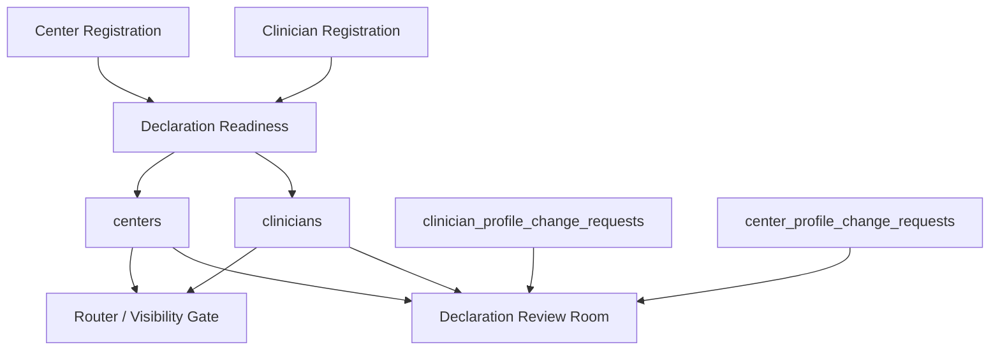

# ADMINISTRATIVE_SIGNAL_FLOW_REPORT_V1

Status: ACTIVE_DOMAIN_AUDIT
Phase: 7C
Runtime effect: none

## Signal Sources

| Source | Output | Classification |
| --- | --- | --- |
| Client registration | `clients` document | ACTIVE |
| Clinician registration | `clinicians` document with declaration/readiness fields | ACTIVE |
| Clinician profile/documents steps | declaration readiness updates | ACTIVE |
| Center registration | `centers` document with declaration/readiness fields | ACTIVE |
| Center profile/media/pricing/documents steps | declaration readiness updates | ACTIVE |
| Clinician profile edit request | `clinician_profile_change_requests` document with declaration signals | ACTIVE |
| Center profile edit request | `center_profile_change_requests` document with declaration signals | ACTIVE |

## Signal Consumers

| Consumer | Purpose | Classification |
| --- | --- | --- |
| App Router/role gate | blocks incomplete visibility readiness | ACTIVE |
| Login routing | directs declaration reviewer and role-specific users | ACTIVE |
| Declaration Review Room | observes clinician, center, and profile update declarations | ACTIVE_READ_ONLY |
| Registration success page | informs applicant about visibility readiness | ACTIVE |

## Signal Flow

## Measures

| Classification | Items |
| --- | --- |
| Active | declaration readiness, profile update declarations, visibility gating |
| Legacy | admin authority language as archived doctrine risk |
| Dead | none confirmed |
| Duplicate | registration aliases and web registration routes |
| Unknown | explicit approval/rejection mutation workflow |
