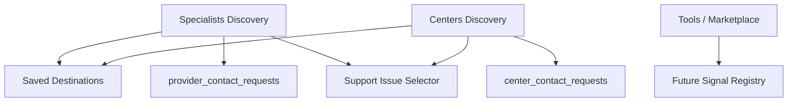

# COMMERCIAL_SIGNAL_FLOW_REPORT_V1

Status: ACTIVE_DOMAIN_AUDIT
Phase: 7B
Runtime effect: none

## Signal Sources

| Source | Output | Classification |
| --- | --- | --- |
| Specialist categories/list/details | provider signal badges, path selections, saved provider destinations | ACTIVE |
| Center landing/list/details | center signal tags, path selections, saved center destinations | ACTIVE |
| Provider contact request | `provider_contact_requests` document | ACTIVE |
| Center contact request | `center_contact_requests` document | ACTIVE |
| City discovery surfaces | discovery intent and future commercial signals | UNKNOWN |
| Tools surface | future tool selection/usage signals | UNKNOWN |

## Signal Consumers

| Consumer | Purpose | Classification |
| --- | --- | --- |
| Client Dashboard/Personal flow | consumes saved destinations and signal tags | ACTIVE/CROSS_DOMAIN |
| Support Issue Selector | receives commercial support handoff | ACTIVE/CROSS_DOMAIN |
| Contact Request repository | persists contact request intent | ACTIVE |
| Future Monitoring | would observe commercial signals if registered | UNKNOWN |

## Signal Flow

## Measures

| Classification | Items |
| --- | --- |
| Active | provider signals, center signals, contact request intent, saved commercial destinations |
| Legacy | provider naming where clinician is runtime identity |
| Dead | none confirmed |
| Duplicate | support handoff path overlaps Residential support |
| Unknown | tool/marketplace signal ownership |
