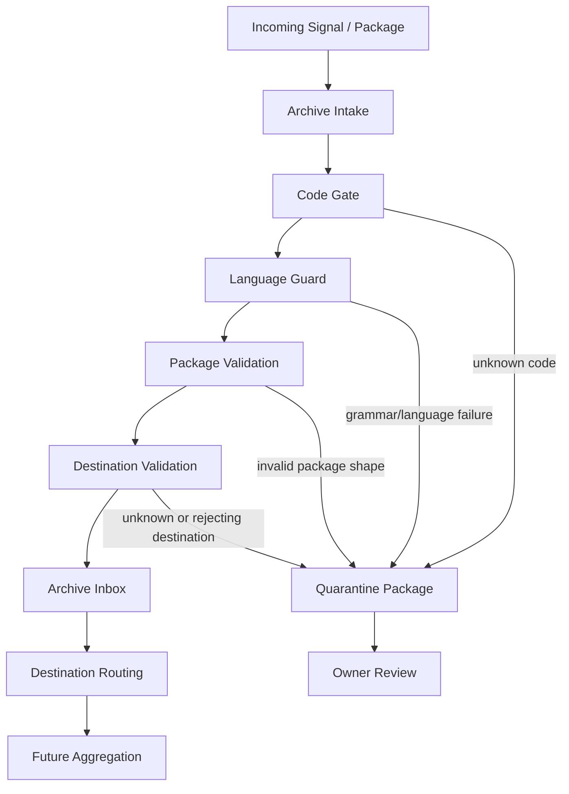

# Archive Intake Pipeline V1

Status: ACTIVE
Date: 2026-07-02

## Pipeline

## Current Boundary

The active foundation ends at Archive Inbox and destination-resolution doctrine. Destination routing and aggregation are future extension points.

## Required Stage Order

1. Code Authority
2. Language Guard
3. Package Shape
4. Destination Exists
5. Destination Accepts Signal
6. Privacy Class
7. Retention Class
8. Archive Inbox

