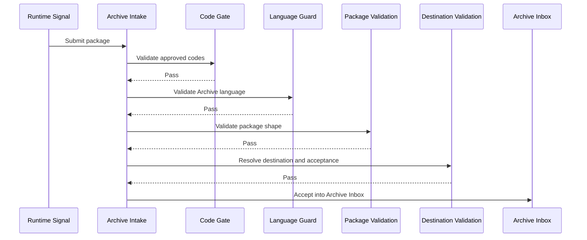
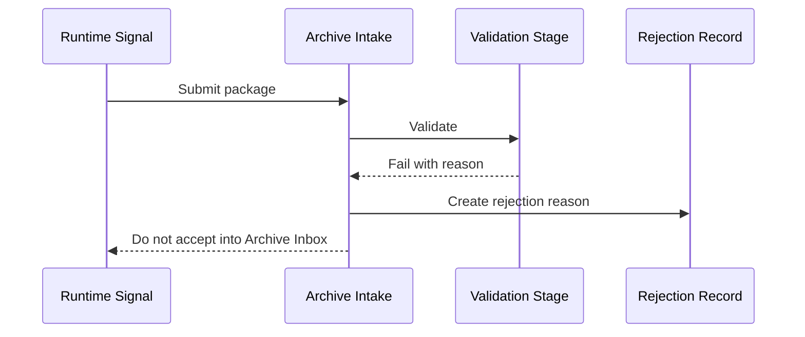
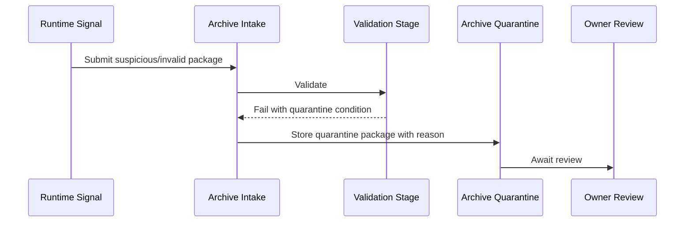

# Archive Intake Sequence V1

Status: ACTIVE
Date: 2026-07-02

## Accepted Flow

```mermaid
sequenceDiagram
  participant Runtime as Runtime Signal
  participant Intake as Archive Intake
  participant Code as Code Gate
  participant Lang as Language Guard
  participant Package as Package Validation
  participant Dest as Destination Validation
  participant Inbox as Archive Inbox

  Runtime->>Intake: Submit package
  Intake->>Code: Validate approved codes
  Code-->>Intake: Pass
  Intake->>Lang: Validate Archive language
  Lang-->>Intake: Pass
  Intake->>Package: Validate package shape
  Package-->>Intake: Pass
  Intake->>Dest: Resolve destination and acceptance
  Dest-->>Intake: Pass
  Intake->>Inbox: Accept into Archive Inbox
```

## Rejected Flow

```mermaid
sequenceDiagram
  participant Runtime as Runtime Signal
  participant Intake as Archive Intake
  participant Gate as Validation Stage
  participant Reject as Rejection Record

  Runtime->>Intake: Submit package
  Intake->>Gate: Validate
  Gate-->>Intake: Fail with reason
  Intake->>Reject: Create rejection reason
  Intake-->>Runtime: Do not accept into Archive Inbox
```

## Quarantine Flow

```mermaid
sequenceDiagram
  participant Runtime as Runtime Signal
  participant Intake as Archive Intake
  participant Gate as Validation Stage
  participant Quarantine as Archive Quarantine
  participant Owner as Owner Review

  Runtime->>Intake: Submit suspicious/invalid package
  Intake->>Gate: Validate
  Gate-->>Intake: Fail with quarantine condition
  Intake->>Quarantine: Store quarantine package with reason
  Quarantine->>Owner: Await review
```

