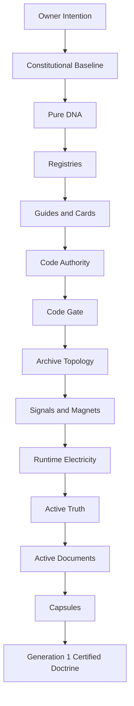

# CAPSULE_DEPENDENCY_GRAPH_V1

Status: ACTIVE

## Purpose

Explain what the Core Doctrine Capsule depends on.

## Dependency Flow

## Required Doctrine Sources

| Source | Why It Matters |
|---|---|
| Master Archive Digital Twin | Defines current Archive authority. |
| Master Sovereign Capsule Template | Defines capsule structure inherited by future capsules. |
| Code Authority Doctrine | Rejects textual markers as authority. |
| Global Code Gate | Requires approved code for active authority. |
| Active Documents Registry | Defines trusted current documents. |
| Platform Final Seal | Certifies pre-capsule readiness. |
| Production Connection Certification | Certifies active governed runtime paths. |
| Residential Capsule | First practical capsule precedent. |
| Library Capsule | Confirms template inheritance. |

FINAL STATUS: CORE_DOCTRINE_DEPENDENCY_GRAPH_CREATED
