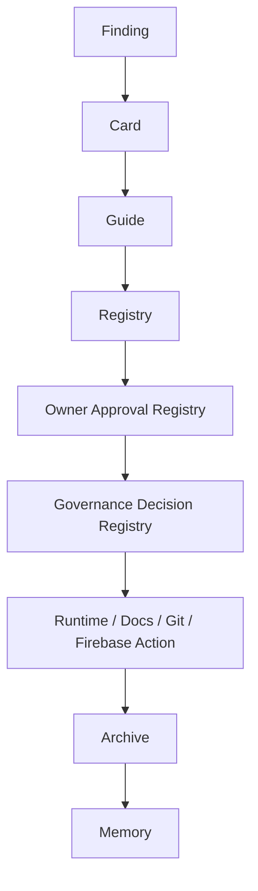

# CORE_GOVERNANCE_REGISTRY_SNAPSHOT_V1

Status: ACTIVE_GOVERNANCE_SNAPSHOT
Phase: 8A
Operation ID: OP-PHASE-8A-CORE-GOVERNANCE-REGISTRY-MATERIALIZATION-V1
Runtime effect: none

## Snapshot Statement

Mental Smile OS now has a materialized core governance registry layer for Owner approval, domain boundaries, monitoring authority, declaration review authority, and governance decisions.

## Governance Chain

## Active Core Registries

- Owner Approval Registry.
- Domain Boundary Registry.
- Monitoring Authority Registry.
- Declaration Review Registry.
- Governance Decision Registry.

## Compliance Baseline

- No major action closes without operation logging.
- No authority expansion occurs without Owner approval.
- No monitoring mutation occurs without Owner approval.
- No declaration review mutation occurs without Owner approval.
- No cross-domain change proceeds without a domain boundary entry.
- No governance decision is considered durable without decision memory.

## Final State

CORE_GOVERNANCE_REGISTRY_LAYER_ACTIVE
