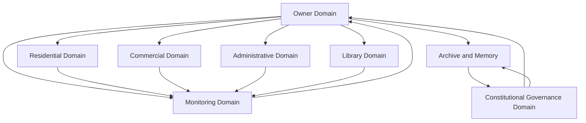
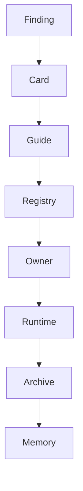

# TOPOLOGY_SNAPSHOT_V1

Status: ACTIVE_TOPOLOGY_SNAPSHOT
Phase: 4
Runtime effect: none

## Snapshot Statement

Mental Smile after Pure DNA V1 is organized as a federated constitutional system. Runtime rooms, commercial discovery, registrations, library knowledge, monitoring, owner systems, and governance memory are separate domains connected through controlled signal, registry, and owner-approval paths.

## Topology Map

## Domain Boundaries

- Residential owns lived user rooms and continuity.
- Commercial owns discovery and future market-facing structure.
- Administrative owns admission, declaration, and verification.
- Library owns knowledge and educational support.
- Monitoring owns observability, escalation visibility, and safety review context.
- Owner owns approval, strategic direction, and constitutional command.
- Constitutional Governance owns doctrine, memory, registries, archive lineage, and operation logging.

## Current Governance Flow

## Pure DNA V1 Position

- C5 and C6 legacy evidence is preserved, but active runtime paths have been purified in Phase 3.
- Active topology is domain-based, not era-based.
- No Git, Firebase, runtime, route, or collection changes were made in this snapshot.

## Required Next Stabilizers

- Owner Approval Registry.
- Signal Ownership Registry.
- Domain Boundary Cards for each domain.
- Collection ownership registry hardening.
- Route ownership registry hardening.
