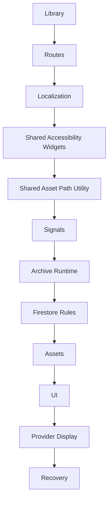

# CAPSULE_DEPENDENCY_GRAPH_V1

Status: ACTIVE

## Dependency Flow

## Required Dependencies

| Dependency | Required Source |
|---|---|
| External Flutter packages | Flutter, Material, `cloud_firestore` |
| Required generated files | Generated `AppLocalizations` from ARB and `l10n.yaml` |
| Required YAML | `pubspec.yaml`, `l10n.yaml` |
| Required Assets | Library backgrounds, specialists assets, centers assets, back buttons, logo, accessibility guide icon |
| Required Localization | Library and provider display keys from `app_en.arb` and `app_ar.arb` |
| Required Registries | Library Active Documents Registry, Library route/screen/signal registries |
| Required Digital Twins | Library Digital Twin, Archive Digital Twin |
| Required Active Documents | 14 Library capsule index snapshots |

FINAL STATUS: CAPSULE_DEPENDENCY_GRAPH_CREATED
