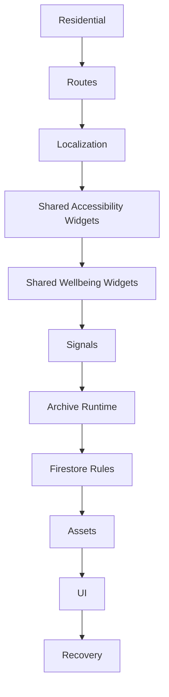

# CAPSULE_DEPENDENCY_GRAPH_V1

Status: ACTIVE

## Purpose

Explain dependency order for rebuilding the Residential capsule.

## Dependency Flow

## Dependency Classes

| Dependency | Required Source |
|---|---|
| External Flutter packages | `flutter`, `flutter_localizations`, `cloud_firestore`, `firebase_core`, `image_picker`, `url_launcher`, Material framework |
| Required generated files | Generated `AppLocalizations` files from ARB and `l10n.yaml` |
| Required YAML | `pubspec.yaml`, `l10n.yaml` |
| Required Assets | Client Room assets, Accessibility Room assets, accessibility guide icon, Residential exit portal background |
| Required Localization | Residential and Accessibility keys from `app_en.arb` and `app_ar.arb` |
| Required Registries | Residential Active Documents Registry, Operations Registry, Route/Signal registries in Residential docs |
| Required Digital Twins | Residential Digital Twin, Archive Digital Twin, Active Documents Registry |
| Required Active Documents | All 14 Residential capsule index snapshots marked `ACTIVE_CURRENT` and `capsule_eligible = YES` |

## Rebuild Order

1. Establish project dependencies and YAML.
2. Restore assets and localization sources.
3. Restore route constants and router cases.
4. Restore shared helper widgets.
5. Restore Residential UI pages.
6. Restore Residential signal runtime.
7. Restore Firestore rules branch.
8. Restore governance docs and active document references.
9. Run manual route and signal verification.

FINAL STATUS: CAPSULE_DEPENDENCY_GRAPH_CREATED
