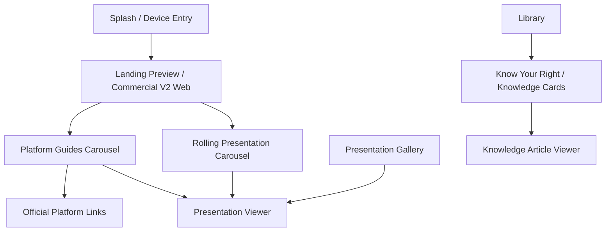

# Global Architecture Map V1

Status: ACTIVE_ARCHITECTURE_MAP
Scope: Mental Smile Platform / Generation 1 Pre-Freeze
Runtime effect: none
Date: 2026-07-07

## Current Active Map

## Ownership Summary

| Area | Owner | Assets | Route |
| --- | --- | --- | --- |
| Landing Evolution | Commercial V2 Web | Landing branding and guide assets | `/landing-preview` |
| Platform Guides | Commercial V2 Web / Library | `assets/library/platform_guides/` | `/landing-preview` |
| Official Links | Library | `assets/library/backgrounds/official_links_background.webp` | `/web/library/official-links` |
| Presentation Gallery | Presentation Gallery | `assets/presentations/` | `/presentation-gallery` |
| Knowledge Cards | Library / Know Your Right | `assets/images/library/know_your_right/cards/`, `assets/content/library/know_your_right/` | `/web/library/know-your-right/cards` |

## Freeze Note

This map supersedes older active-memory references that did not include the Presentation Gallery, Platform Guides carousel, Official Links page, or Knowledge Cards engine.
